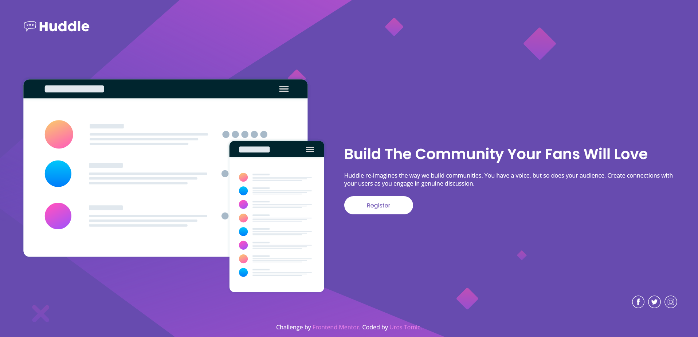

# Frontend Mentor - Huddle landing page with single introductory section solution

This is a solution to the [Huddle landing page with single introductory section challenge on Frontend Mentor](https://www.frontendmentor.io/challenges/huddle-landing-page-with-a-single-introductory-section-B_2Wvxgi0). Frontend Mentor challenges help you improve your coding skills by building realistic projects. 

## Table of contents

- [Overview](#overview)
  - [The challenge](#the-challenge)
  - [Screenshot](#screenshot)
  - [Links](#links)
- [My process](#my-process)
  - [Built with](#built-with)
  - [What I learned](#what-i-learned)
  - [Continued development](#continued-development)
  - [Useful resources](#useful-resources)
- [Author](#author)

## Overview

### The challenge

Users should be able to:

- View the optimal layout for the page depending on their device's screen size
- See hover states for all interactive elements on the page

### Screenshot

### Links

- Solution URL: [https://www.frontendmentor.io/solutions/bem-sass-html5-mobilefirst-flexbox-LPJn-V-LM](https://www.frontendmentor.io/solutions/bem-sass-html5-mobilefirst-flexbox-LPJn-V-LM)
- Live Site URL: [https://mrgeminus.github.io/huddle-landing-page-with-single-introductory-section/](https://mrgeminus.github.io/huddle-landing-page-with-single-introductory-section/)

## My process

### Built with

- Semantic HTML5 markup
- CSS pre-processor (SASS)
- Flexbox
- Mobile-first workflow
- BEM naming convention

### What I learned

I used this opportunity to practice BEM naming, sass, and application of good accessibility practices.

### Continued development

### Useful resources

- [Iconfinder](https://www.iconfinder.com/) - Great platform for finding icons.

## Author

- Website - [Uros Tomic](https://mrgeminus.com/)
- Frontend Mentor - [@MrGeminus](https://www.frontendmentor.io/profile/MrGeminus)
- LinkedIn - [Uros Tomic](https://www.linkedin.com/in/mrgeminus/)
- Xing - [Uros Tomic](https://www.xing.com/profile/Uros_Tomic3/cv)
- StackOverflow - [MrGeminus](https://www.linkedin.com/in/mrgeminus/)
- Twitter - [@MrGeminus](https://twitter.com/MrGeminus)